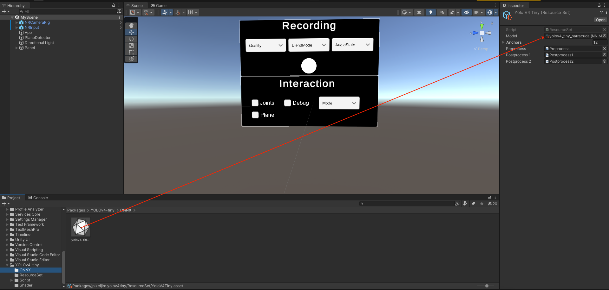

# Android application for Nreal Light AR glasses

This folder contains the Unity project of the android application built for the Nreal Light AR glasses, using the official NRSDK library. Here is implemented the pipeline already seen on the main page of this repo, making use of a package called **jp.keijiro.yolov4tiny**, that allow one to use a Tiny YOLOv4 ONNX model inside Unity. If you want to add a custom model (like I did), go to `CustomTinyYOLOv4` and follow the guide I already made for you. Once you obtained the ONNX model, add it to `Packages/jp.keijiro.yolov4tiny/ONNX`. In Unity, drag and drop this new model the the inspector of `Packages/jp.keijiro.yolov4tiny/ResourceSet/YoloV4Tiny.asset`, as shown below.

  

Your new model can now be used by the application for the task of object detection.

# References

The Unity package **jp.keijiro.yolov4tiny** was provided by **Keijiro Takahashi** through the repo <a href="https://github.com/keijiro/YoloV4TinyBarracuda">**YoloV4TinyBarracuda**</a>.