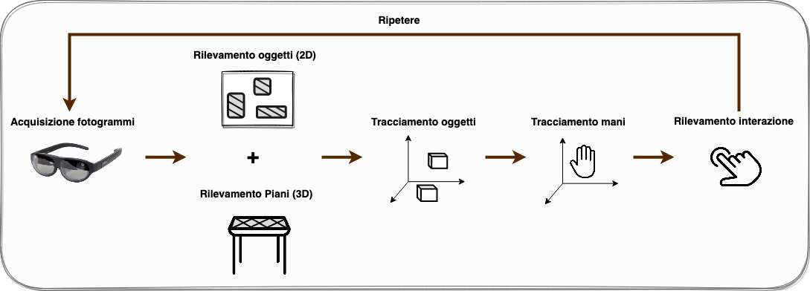

# Project Goals

The main aim of this project is to support **factory workers** in their daily duties by using an artificial intelligent system that, given a pair of **Nreal Light** AR glasses, is capable of detecting interactions between the hand of the user and a set of working tools (like pliers, screwdriver, oscilloscope etc.). Whenever an interaction is detected by the system, it will be shown to the user, through **augmented reality**, an info box containing information about the touched object (like what is it and how to use it). In this way, it is possible to enhance his knowledge in real-time and make his work simpler and more safe.

# Solution

To create the system above, it was created an android application for the Nreal Light glasses that periodically repeats the following steps:

  

1. frames acquisition using the embedded RGB camera of Nreal Light;
2. application of the object detector Tiny YOLOv4 to the acquired frames, in order to detect and obtain the 2D positions of objects inside those frames;
3. 2D-3D transformation of the detected objects position;
4. tracking of the objects position;
5. tracking of the user's hand;
6. computation of the hand-objects euclidean distances to check if an interaction is made and, if so, show some info about the object the user interacted with.

# Results

Once an interaction has been detected it will be shown a text and a video information. The text answers the questions "What is this object?" and "What is this object used for?". The video shows a specific use case of the object. Below there is an example of application usage.

  

# Quickstart

If you want to just use this application on your own smartphone + Nreal Light glasses setup, just download the already built apk file, available via this Google Drive <a href="https://drive.google.com/drive/folders/1JK751fjUOutuwkM7gZVN96SG1AfTAZ_B?usp=sharing">link</a>. If you want to edit this version to add some edits (e.g. change the ONNX model with another one created by you), you have to clone this repository and open the project folder named **InteractionDetection** in UnityHub. Then, before building your final apk file, go to **File > Build Settings** and switch platform to **Android**. Enjoy the power of AR!

NOTE: If you didn't yet install nebula (available on PlayStore), do it before opening the previously installed application.

# Author
[Alessandro Resta](https://github.com/Alessandrus00)

